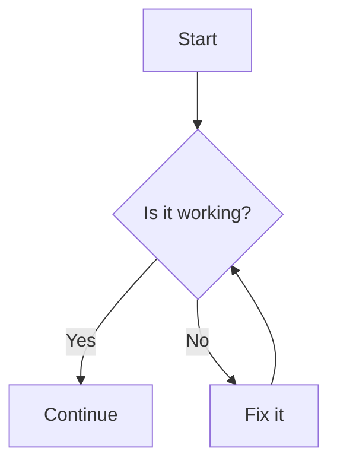

# Superfences Tutorial

In **MkDocs Material**, **SuperFences** is an advanced Markdown extension that enhances the functionality of standard fenced code blocks. It provides additional features such as multi-language highlighting, integrated captions, and support for nested code blocks, making your documentation more versatile and visually appealing.

## Table of Contents

1. [What Are SuperFences?](#what-are-superfences)
2. [Enabling SuperFences in MkDocs Material](#enabling-superfences-in-mkdocs-material)
3. [Features of SuperFences](#features-of-superfences)
4. [Usage Examples](#usage-examples)
   - [Basic Fenced Code Blocks](#basic-fenced-code-blocks)
   - [Multi-Language Code Blocks](#multi-language-code-blocks)
   - [Adding Captions](#adding-captions)
   - [Line Highlighting](#line-highlighting)
   - [Embedding Diagrams](#embedding-diagrams)
5. [Customization Options](#customization-options)
6. [Best Practices](#best-practices)
7. [Additional Resources](#additional-resources)


## What Are SuperFences?

**SuperFences** is a Markdown extension developed for the Python-Markdown library, which MkDocs uses to process Markdown files. It extends the capabilities of standard fenced code blocks (those enclosed by triple backticks ````` or tildes `~~~`) by allowing:

- **Multiple Languages**: Combine different languages or preprocessors within a single block.
- **Embedded Diagrams**: Integrate diagrams using tools like Mermaid.
- **Captions and Titles**: Add descriptive titles or captions to code blocks.
- **Line Highlighting**: Highlight specific lines within the code for emphasis.
- **Nested Code Blocks**: Embed code blocks within other code blocks.

These enhancements make your documentation more informative and easier to understand.


## Enabling SuperFences in MkDocs Material

**MkDocs Material** comes with SuperFences enabled by default through its support for [Pymdown Extensions](https://facelessuser.github.io/pymdown-extensions/). However, to ensure it's active and to customize its behavior, follow these steps:

1. **Install MkDocs Material** (if not already installed):

```bash
pip install mkdocs-material
```

2. **Configure `mkdocs.yml`**:

   Open your `mkdocs.yml` configuration file and ensure that the `pymdownx.superfences` extension is enabled. Here's how you can do it:

```yaml
site_name: Your Documentation

markdown_extensions:
    - pymdownx.superfences
    - pymdownx.highlight
    - admonition
    - toc:
        permalink: true

theme:
    name: material
    # Additional theme configurations
```

   **Note**: MkDocs Material often pre-configures many extensions. If you're using a custom setup, ensure that `pymdownx.superfences` is included in the `markdown_extensions` list.

3. **Optional Configurations**:

   SuperFences can be customized using additional settings. For example, to enable or disable certain features, you can pass configurations within the `pymdownx.superfences` extension:

```yaml
markdown_extensions:
    - pymdownx.superfences:
        delimiters:
        - marker: '`'
            options:
            fence: true
            classes: [ "superfence-class" ]
        process_fenced_code_blocks: true
    - pymdownx.highlight
    # Other extensions
```

   Refer to the [SuperFences Documentation](https://facelessuser.github.io/pymdown-extensions/extensions/superfences/) for detailed configuration options.

## Features of SuperFences

SuperFences enhances Markdown's fenced code blocks with the following features:

1. **Multi-Language Support**:
   - Combine multiple languages or preprocessors within a single code block.
   - Useful for showcasing code that involves different technologies or templating languages.

2. **Captions and Titles**:
   - Add descriptive titles or captions to your code blocks.
   - Helps in providing context or explanations alongside the code.

3. **Line Highlighting**:
   - Highlight specific lines within the code block to draw attention to important sections.
   - Enhances readability and focuses the reader's attention.

4. **Embedded Diagrams**:
   - Integrate diagrams using tools like Mermaid or PlantUML directly within your documentation.
   - Facilitates visual explanations alongside textual content.

5. **Custom Classes and Styling**:
   - Apply custom CSS classes to code blocks for further styling and customization.

## Usage Examples

Below are various examples demonstrating how to utilize SuperFences in MkDocs Material to leverage its advanced features.

### 1. Basic Fenced Code Blocks

SuperFences supports standard fenced code blocks with enhanced syntax highlighting.

```markdown
```python
def greet():
    print("Hello, World!")
```
```

**Rendered Output:**

```python
def greet():
    print("Hello, World!")
```

### 2. Multi-Language Code Blocks

Combine different languages or preprocessors within a single code block using SuperFences.

```markdown
```html+jinja
<!DOCTYPE html>
<html lang="en">
<head>
    <meta charset="UTF-8">
    <title>{{ title }}</title>
</head>
<body>
    <h1>{{ header }}</h1>
    <p>{{ content }}</p>
</body>
</html>
```
```

**Rendered Output:**

```html+jinja
<!DOCTYPE html>
<html lang="en">
<head>
    <meta charset="UTF-8">
    <title>{{ title }}</title>
</head>
<body>
    <h1>{{ header }}</h1>
    <p>{{ content }}</p>
</body>
</html>
```

### 3. Adding Captions

Provide descriptive titles or captions to your code blocks for better context.

```markdown
```python title="greet.py"
def greet():
    print("Hello, World!")
```
```

**Rendered Output:**

```html
<div class="code-block">
  <div class="code-title">greet.py</div>
  <pre><code class="language-python">def greet():
    print("Hello, World!")</code></pre>
</div>
```

*Note: The actual rendering may vary based on your MkDocs Material theme settings.*

### 4. Line Highlighting

Highlight specific lines within your code block to emphasize important sections.

```markdown
```javascript {5,7}
function add(a, b) {
    return a + b;
}

console.log(add(2, 3));
```
```

**Rendered Output:**

```javascript {5,7}
function add(a, b) {
    return a + b;
}

console.log(add(2, 3));
```

*Lines 5 and 7 will be highlighted based on your theme's styling.*

### 5. Embedding Diagrams

Integrate diagrams directly within your Markdown using Mermaid.

```markdown

```

**Rendered Output:**


*This will render a flowchart diagram if Mermaid is supported and properly configured.*

---

## Customization Options

SuperFences can be tailored to fit the specific needs of your documentation through various configuration settings and CSS customizations.

### 1. Configuring SuperFences in `mkdocs.yml`

You can pass specific options to the `pymdownx.superfences` extension to customize its behavior.

```yaml
markdown_extensions:
  - pymdownx.superfences:
      extensions:
        - pymdownx.highlight
      custom_fences:
        - name: mermaid
          format: |
            ```mermaid
            {code}
            ```
        - name: diagram
          format: |
            ```diagram
            {code}
            ```
```

### 2. Custom CSS for Code Blocks

Enhance the appearance of your code blocks by adding custom CSS. For example, to style captions or highlighted lines:

```css
/* Style for code block titles */
.code-title {
    background-color: #f5f5f5;
    padding: 5px 10px;
    font-weight: bold;
    border-bottom: 1px solid #ddd;
}

/* Style for highlighted lines */
pre code .highlighted {
    background-color: #ffff99;
}
```

**Note**: You can include this CSS in your MkDocs Material theme by adding it to the `extra_css` section in `mkdocs.yml` or by placing it in a custom CSS file.

### 3. Integrating JavaScript Libraries

For interactive features like copy-to-clipboard buttons or live code editing, integrate JavaScript libraries such as:

- **Prism.js**: Advanced syntax highlighting.
- **Clipboard.js**: Add copy buttons to code blocks.
- **Mermaid.js**: Render diagrams.

**Example: Adding Clipboard.js**

1. **Include Clipboard.js in `mkdocs.yml`:**

   ```yaml
   extra_javascript:
     - https://cdnjs.cloudflare.com/ajax/libs/clipboard.js/2.0.6/clipboard.min.js
     - js/custom.js
   ```

2. **Create `custom.js` with Clipboard Functionality:**

   ```javascript
   document.addEventListener('DOMContentLoaded', function() {
       var clipboard = new ClipboardJS('.copy-button', {
           target: function(trigger) {
               return trigger.nextElementSibling;
           }
       });

       clipboard.on('success', function(e) {
           e.trigger.textContent = 'Copied!';
           setTimeout(function() {
               e.trigger.textContent = 'Copy';
           }, 2000);
       });

       clipboard.on('error', function(e) {
           e.trigger.textContent = 'Failed';
       });
   });
   ```

3. **Modify Markdown to Include Copy Button:**

   ```markdown
   <button class="copy-button">Copy</button>
   ```python
   def greet():
       print("Hello, World!")
   ```
   ```

**Note**: The exact implementation may vary based on your requirements and the structure of your Markdown.

---

## Best Practices

1. **Use Semantic Language Tags**:
   - Specify the correct language after the opening fence for accurate syntax highlighting.
   - Example: `````python````` for Python code.

2. **Keep Code Blocks Concise**:
   - Avoid excessively long code blocks. Break them into smaller, manageable sections if necessary.

3. **Provide Context with Captions**:
   - Use captions or titles to give readers an idea of what the code does or its purpose.

4. **Highlight Important Lines**:
   - Use line highlighting to draw attention to crucial parts of the code, especially in tutorials or guides.

5. **Ensure Accessibility**:
   - Make sure that color contrasts for code blocks and highlighted lines meet accessibility standards.
   - Provide alternative text or descriptions for embedded diagrams.

6. **Test Across Devices**:
   - Verify that code blocks render correctly on different devices and screen sizes.

---

## Additional Resources

- **MkDocs Material Documentation**:
  - [Official Documentation](https://squidfunk.github.io/mkdocs-material/)
  
- **Pymdown Extensions (SuperFences)**:
  - [SuperFences Extension](https://facelessuser.github.io/pymdown-extensions/extensions/superfences/)
  
- **SuperFences GitHub Repository**:
  - [pymdown-extensions/superfences](https://github.com/facelessuser/pymdown-extensions)
  
- **Mermaid Documentation**:
  - [Mermaid.js](https://mermaid-js.github.io/mermaid/#/)
  
- **Clipboard.js Documentation**:
  - [Clipboard.js](https://clipboardjs.com/)

---

## Conclusion

**SuperFences** significantly enhances the capabilities of Markdown in **MkDocs Material**, allowing for more dynamic and informative documentation through advanced code block features. By leveraging multi-language support, captions, line highlighting, and embedded diagrams, you can create comprehensive and engaging documentation that caters to diverse reader needs.

Remember to customize your `mkdocs.yml` and CSS to align with your project's aesthetic and functional requirements. For complex integrations or specific use-cases, refer to the official documentation of the extensions and libraries you intend to use.

If you encounter any issues or need further customization guidance, feel free to ask!