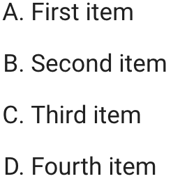

# Test of Superfences Custom

Our goal it to use uppercase
letters to style the ordered list like this.

{width="100px"}

Our final result is to a superfence that adds
a <div\> with a class in markdown.

~~~
```markdown {.upper-alpha}
1. Response 1
2. Response 2
3. Response 3
4. Response 4
```
~~~

Which renders this:

```markdown {.upper-alpha}
1. Response 1
2. Response 2
3. Response 3
4. Response 4
```

The trick is to not force the order list, but to just
add a lot of CSS to make the pre/code blocks look like lists.

From this:

```html
<div class="upper-alpha highlight">
  <pre>
    <span></span>
    <code>
      <span class="k">1.</span> Response 1
      <span class="k">2.</span> Response 2
      <span class="k">3.</span> Response 3
      <span class="k">4.</span> Response 4
    </code>
  </pre>
</div>
```

Using the following CSS:

```css
.upper-alpha {
    counter-reset: list-counter; /* Initialize the counter */
    font-family: Arial, sans-serif; /* Optional: Set a preferred font */
    font-size: 16px;               /* Optional: Set font size */
    color: black;                   /* Optional: Set text color */
  }
  
  .upper-alpha pre {
    margin: 0; /* Remove default margin */
  }
  
  .upper-alpha code {
    display: block;               /* Ensure code block occupies full width */
    white-space: pre-wrap;        /* Allow line wrapping */
    position: relative;           /* Establish a positioning context for absolute elements */
  }
  
  .upper-alpha .k {
    display: inline-block;        /* Allow setting width and positioning */
    width: 15px;                  /* Space for the counter */
    position: relative;           /* Positioning context for ::before */
    color: transparent;           /* Hide existing numbers */
  }
  
  .upper-alpha .k::before {
    counter-increment: list-counter; /* Increment the counter */
    content: counter(list-counter, upper-alpha) ". "; /* Display A., B., etc. */
    position: absolute;
    left: 0; /* Align to the left of the .k span */
    color: black; /* Color of the new markers */
    /* Adjust vertical alignment if necessary */
    top: 0; 
  }
```

The mkdocs.yml is simple

```yaml
site_name: Test Superfences

nav:
  - Home: index.md

theme:
  name: material

markdown_extensions:
  - pymdownx.superfences:
  
extra_css:
  - css/extra.css
```

This allows us to wrap the ordered list in a div that
has a class specified in the markdown. 

## Test #1: Default Numeric Ordered List

1. Response 1
2. Response 2
3. Response 3
4. Response 4

This is the default for mkdocs material markdown. 
It has a green boarder showing the <ol\> element
is present in the HTML per this CSS rule:

```css
/* for showing that the ol elements are in the HTML */
ol {
    border: solid green 3px;
}
```

## Test #2 Using Superfences for Upper Alpha Order

This is the format for superfences.  The three colons
```:::``` that bracket the block must match and must
not be indented.

```
::: {.upper-alpha}
1. Response 1
2. Response 2
3. Response 3
4. Response 4
:::
```

Here is how it looks:

::: {.upper-alpha}
1. Response 1
2. Response 2
3. Response 3
4. Response 4
:::

The mkdocs.yml is the following:

```yml
site_name: Test Superfences
nav:
  - Home: index.md

theme:
  name: material

markdown_extensions:
  - attr_list
  - pymdownx.superfences:
      custom_fences:
        - name: div
          class: ''
          format: !!python/name:pymdownx.superfences.fence_div_format
extra_css:
  - css/extra.css
```

The superfence should wrap the <ol\> in a <div\>:

```html
<div class="upper-alpha">
    <ol>
        <li>First item</li>
        <li>Second item</li>
        <li>Third item</li>
        <li>Fourth item</li>
    </ol>
</div>
```

The CSS for rendering this in upper alpha is the following:

```css
.upper-alpha > ol {
    list-style-type: upper-alpha;
}
```

This fails and the ":::" are showing in the HTML.

```
::: {.upper-alpha} 1. Response 1 2. Response 2 3. Response 3 4. Response 4 :::
```

The trick of adding the property after the last element fails since the attributes are not added to the ol

1. First item
2. Second item
3. Third item
4. Fourth item
{:.upper-alpha}

```html
<ol>
    <li>First item</li>
    <li>Second item</li>
    <li>Third item</li>
    <li>Fourth item</li>
</ol class="upper-alpha">
```

## Markdown Lists Within Divs Also Fail

```html
<div class="upper-alpha">
1. First item
2. Second item
3. Third item
4. Fourth item
</div>
```

<div class="upper-alpha">
1. First item
2. Second item
3. Third item
4. Fourth item
{:.upper-alpha}
</div>

## Pure HTML Works

<div class="upper-alpha">
    <ol>
        <li>First item</li>
        <li>Second item</li>
        <li>Third item</li>
        <li>Fourth item</li>
    </ol>
</div>

## This Works

```html
<ol class="upper-alpha">
    <li>First item</li>
    <li>Second item</li>
    <li>Third item</li>
    <li>Fourth item</li>
</ol>
```

```css
ol.upper-alpha {
    list-style-type: upper-alpha; 
}
```

<ol class="upper-alpha">
    <li>First item</li>
    <li>Second item</li>
    <li>Third item</li>
    <li>Fourth item</li>
</ol>

## attr_list vs. markdown.extensions.extra

We have tried both the ```attr_list``` as
well as the ```markdown.extensions.extra```
configuration in our mkdocs.yml.  Neither
of them seem to work.

## Custom Format

I have also tried different formats for the format

Bang bang python/name format:

```yml
   format: !!python/name:pymdownx.superfences.fence_div_format
```
vs. simple string format

```yml
   format: pymdownx.superfences.fence_div_format
```

## Other Tests

```markdown {.upper-alpha}
1. Response 1
2. Response 2
3. Response 3
4. Response 4
```

```markdown {.upper-alpha}
1. Response 1
2. Response 2
3. Response 3
4. Response 4
```

~~~markdown {.upper-alpha}
1. Response 1
2. Response 2
3. Response 3
4. Response 4
~~~

:::markdown {.upper-alpha}
1. Response 1
2. Response 2
3. Response 3
4. Response 4
:::

## References

 This is suggested here: [PyMarkdown Extensions Superfences](https://facelessuser.github.io/pymdown-extensions/extensions/superfences/)
